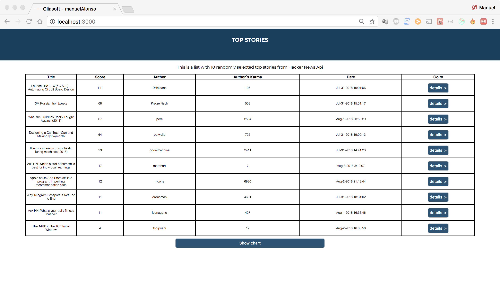
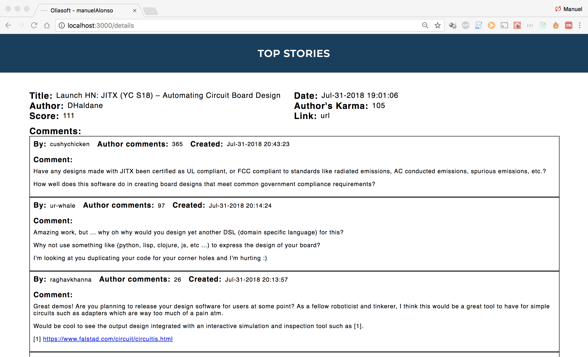
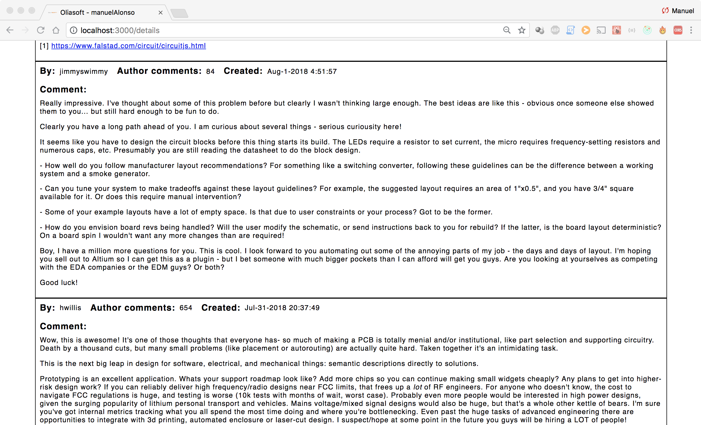
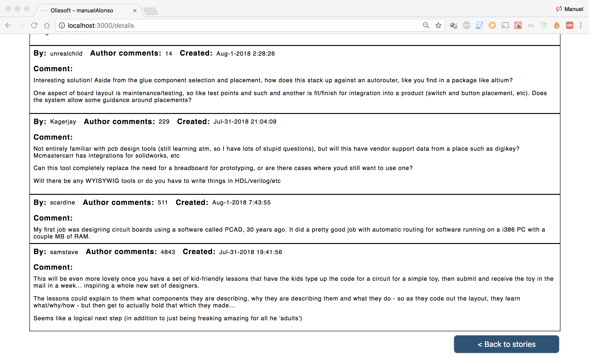
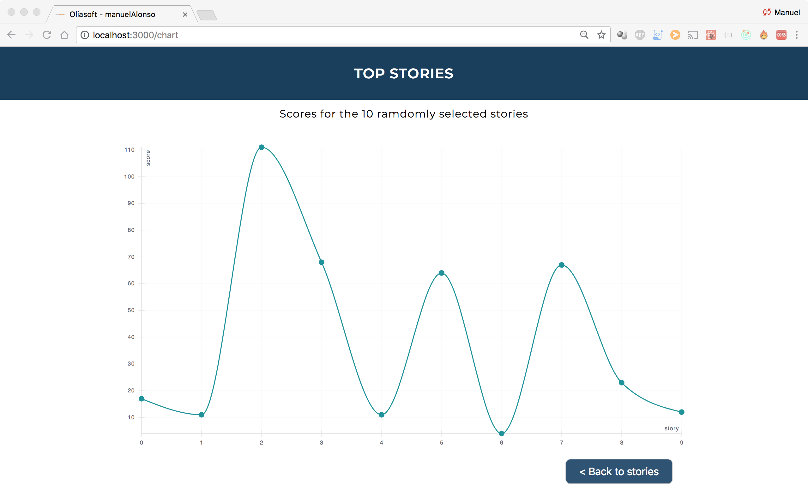

## Project Description:

This project creates a table from most popular stories on Hacker News. The stories are  fetched from  the [following](https://github.com/HackerNews/API) Api.

The main-view component allows us to see 10 stories  at a time  with its details. Clicking on each story we have the posibility to see the details for a selected story and the first 10 comments.

The project includes also a chart showing the scores for the selected 10 stories. The chart is created using [Uber react-vis](https://uber.github.io/react-vis/documentation/welcome-to-react-vis) library.

## Installing:

####  Dependencies

You need to have Node.js installed to run the project

[Download Node.js](https://nodejs.org/en/download/ "Download Node.js")

Check in linux terminal that package was installed properly

`node -v`

Check also npm is installed

`npm -v`

#### On linux terminal

1. In target directory clone the repository from gitHub

	` git clone https://github.com/manuelAlonsoPerez/stories_viewer.git`

2. Navigate to project folder

	`cd stories_viewer`

3. Install package

	`npm install`

4. Run project

	`npm start`

5. Now you can open the project in you browser at:

[http://localhost:3000](http://localhost:3000/ "http://localhost:3000/")

#### Alternatively

Download  .zip, .tar, .tar.gz or .tar compressed package, decompress it to target folder and follow from Step 2.

## Status

The  project is tested and working on Chrome, Firefox and Safari. Loading icon works only on Chrome due to .webp format. API calls are resolved with axios, taking into account the time to resolve the promise and catching possible errors.

The store is connected to redux thunk middleware to add a more robust handling of async API calls. And is also connected  to redux-devtools for easier debugging.

